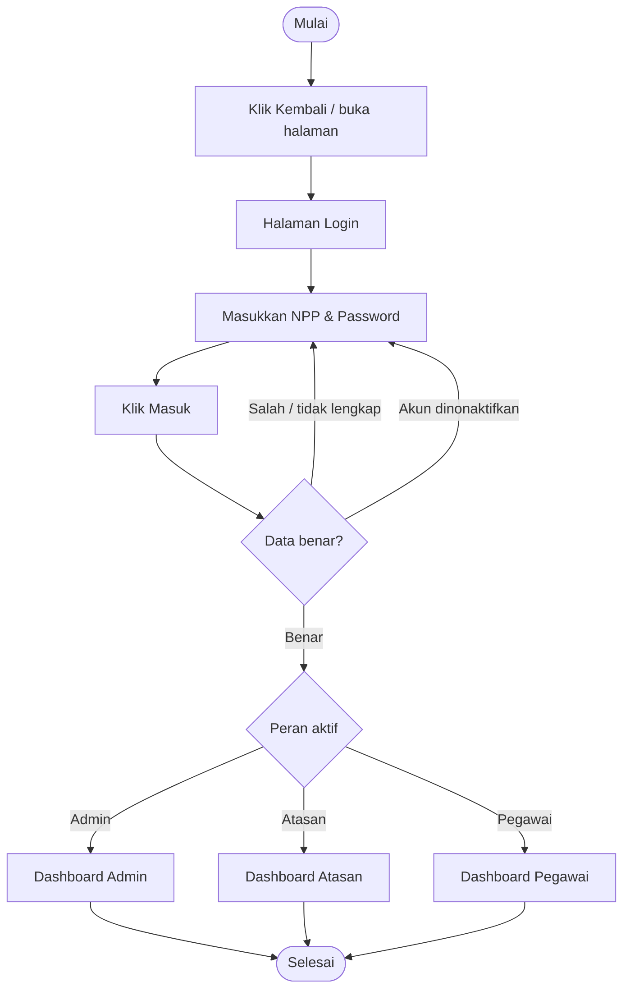

# Workflow Login

### Penjelasan
1. Buka halaman login, masukkan **NPP** (7 digit) dan **password**.
2. Klik **Masuk** — sistem memvalidasi data & memeriksa akun aktif.
3. Setelah berhasil, pengguna diarahkan ke dashboard sesuai perannya:
   - **Admin** → Dashboard Admin
   - **Atasan** → Dashboard Atasan
   - **Pegawai** → Dashboard Pegawai
