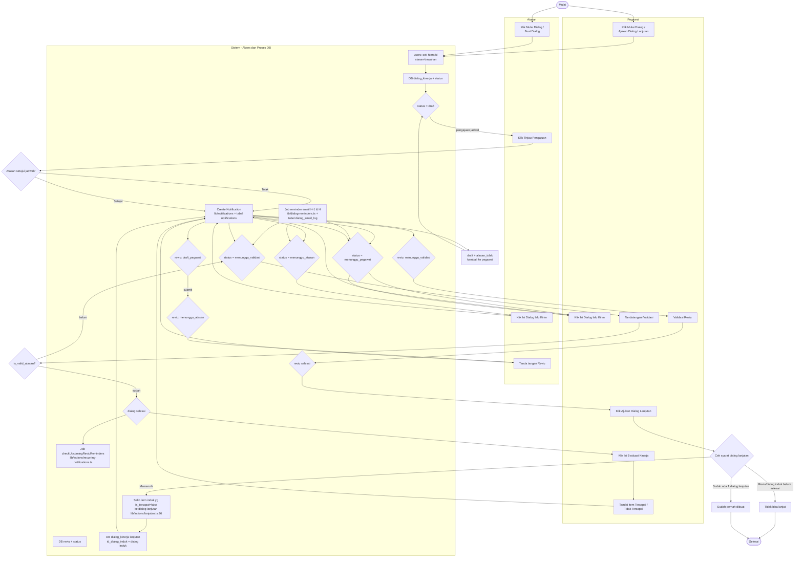

# Workflow Sistem — Dialog Kinerja (End-to-End)

Satu alur utuh dari **Dialog → Reviu → Dialog Lanjutan → Reviu lagi**, digabung dengan sisi
**sistem** (database, notifikasi, email). Warna status diambil dari enum `StatusDialog` &
`StatusReviu`.

## Diagram Utuh

## Alur Status (urutan)

### Dialog (`StatusDialog`)
`draft` → `menunggu_pegawai` → `menunggu_atasan` → `menunggu_validasi` → `selesai`

- **draft** — panggulan jadwal, belum disetujui. Jika ditolak, kembali ke `draft` (alasan_tolak diisi).
- **menunggu_pegawai** — disetujui; pegawai (dan atasan) mengisi isian.
- **menunggu_atasan** — pegawai sudah isi; giliran atasan mengevaluasi & tanda tangan.
- **menunggu_validasi** — menunggu validasi pegawai (cek `is_valid_atasan`).
- **selesai** — dialog terkunci, bisa diunduh PDF/DOCX.

### Reviu (`StatusReviu`)
`draft_pegawai` → `menunggu_atasan` → `menunggu_validasi` → `selesai`

## Sisi Sistem (database & background)

| Proses | Lokasi kode | Efek DB |
|---|---|---|
| Hierarki atasan↔bawahan & peran | `lib/auth/guards.ts`, `capabilitiesForUser` | `users` (id_atasan, is_admin, as_pegawai) |
| Buat dialog (draft) | `lib/actions/atasan.ts:14`, `lib/actions/pegawai.ts:400` | `dialog_kinerja` + `dialog_kinerja_aspek` + `dialog_kinerja_item` |
| Setujui / tolak pengajuan | `lib/actions/atasan.ts:321 / 373` | `dialog_kinerja.status` + `alasan_tolak` |
| Simpan evaluasi pegawai | `saveDialogForm` `lib/actions/pegawai.ts:147` | status → `menunggu_atasan`, isi aspek/item |
| Evaluasi atasan | `submitEvaluasi` `lib/actions/atasan.ts:430` | status → `menunggu_validasi`, `is_valid_atasan` |
| Validasi pegawai | `validateDialog` `lib/actions/pegawai.ts:327` | status → `selesai` bila `is_valid_atasan` |
| Buat reviu | `createReviu/saveReviu` `lib/actions/reviu.ts:117/200` | `reviu` + tulis balik `is_tercapai` ke item dialog induk via `applyItemCapaian` (`reviu.ts:92`) |
| Submit reviu atasan | `submitReviuAtasan` `lib/actions/reviu.ts:304` | `reviu.status` → `menunggu_validasi` |
| Validasi reviu | `validateReviu` `lib/actions/reviu.ts:366` | `reviu.status` → `selesai` |
| **Dialog lanjutan** | `createDialogLanjutan` `lib/actions/lanjutan.ts:24` | salin item induk `is_tercapai=false` → dialog baru (`id_dialog_induk`) |
| Notifikasi in-app | `createNotification` `lib/notifications` | `notifications` |
| Email reminder H-1 & H | `runDialogReminderJob` `lib/dialog-reminders.ts` | `dialog_email_log` (dedup) |
| Reminder reviu | `checkUpcomingReviuReminders` `lib/actions/recurring-notifications.ts` | `notifications` |

## Catatan Ketelitian (decision)

- **"Yang tidak tercapai"** pada dialog lanjutan = `dialogKinerjaItem.is_tercapai === false` pada
  dialog induk, **bukan** field `is_tercapai` pada tabel `reviu`. Flag item itu di-update oleh
  reviu lewat `applyItemCapaian` (`lib/actions/reviu.ts:92`).
- Satu dialog induk hanya boleh punya **satu** `dialog_lanjutan` (guard `lib/actions/lanjutan.ts:69`
  dan `pegawai.ts:470`).
- Agar **loop** berlanjut: semua node harus `selesai` →
  dialog selesai → reviu selesai → dialog lanjutan selesai → reviu lagi ... dst.
