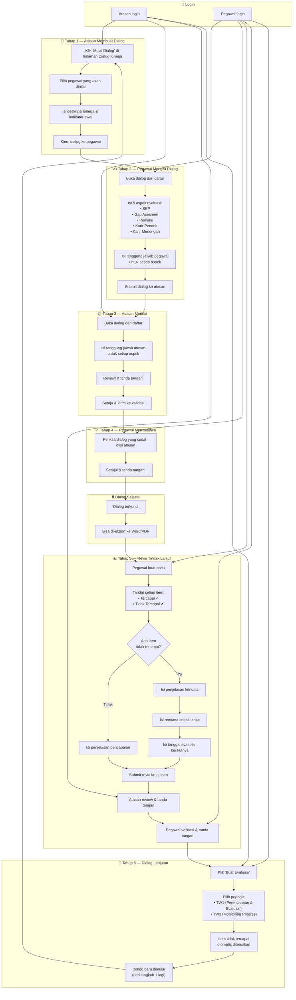
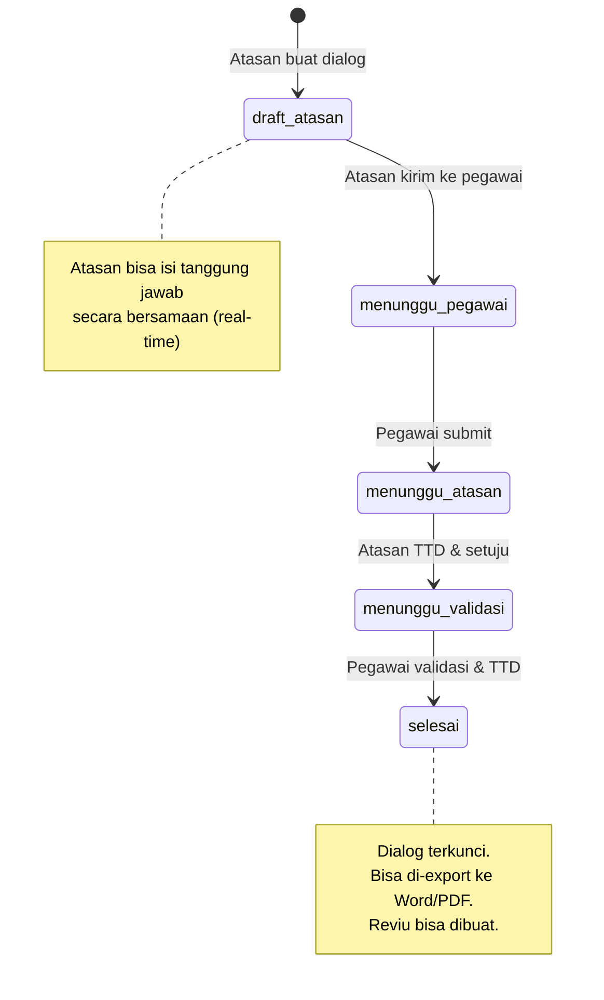
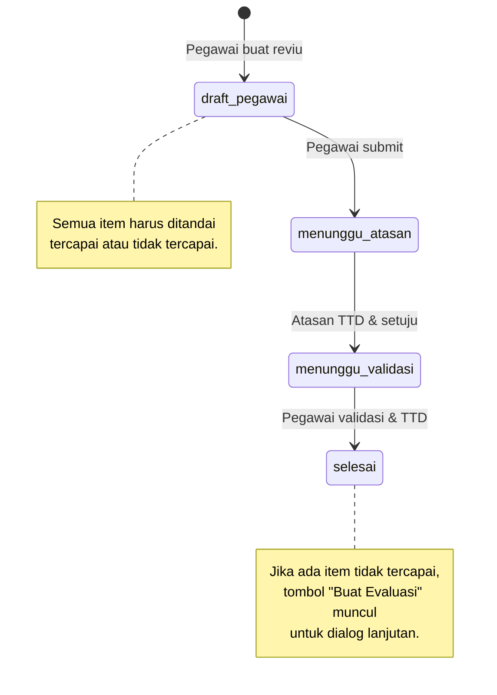
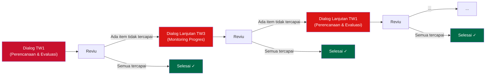
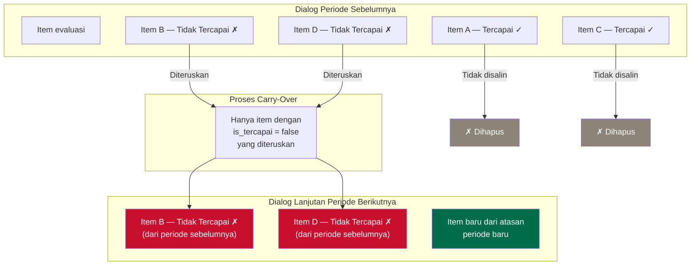

# Workflow Dialog Kinerja

Diagram alur kerja sistem Dialog Kinerja KPK menggunakan Mermaid.js.

## Alur Lengkap (Siklus Berkelanjutan)

## Status Transitions

### Dialog Kinerja

### Reviu Tindak Lanjut

## Siklus Berkelanjutan

## Carry-Over Item

## Aturan Penting

| Aturan | Keterangan |
|--------|-----------|
| Satu dialog per triwulan | Satu pegawai hanya boleh memiliki satu dialog per triwulan per tahun |
| Maksimal satu lanjutan | Setiap dialog hanya boleh memiliki satu dialog lanjutan |
| Hanya TW1 & TW3 | Dialog lanjutan hanya bisa dibuat untuk Triwulan I atau III |
| Carry-over selektif | Hanya item `is_tercapai = false` yang diteruskan |
| Dialog terkunci | Setelah status `selesai`, dialog tidak bisa diubah |
| Reviu wajib semua item | Semua item harus ditandai tercapai/tidak tercapai |
| Field wajib | Jika ada item tidak tercapai: penjelasan, rencana tindak lanjut, dan tanggal evaluasi berikutnya wajib diisi |
